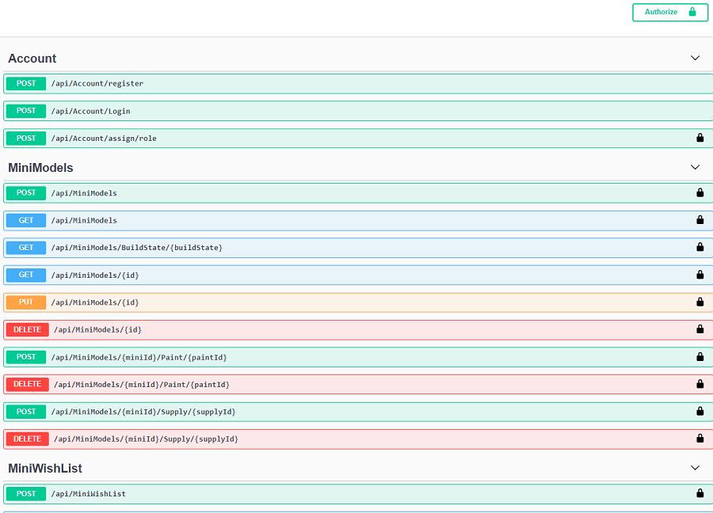
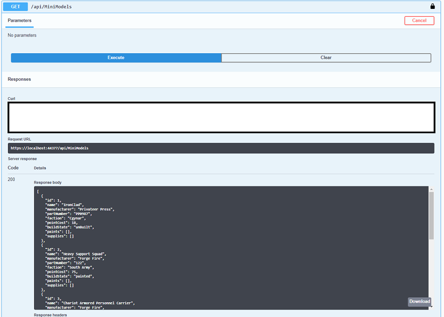
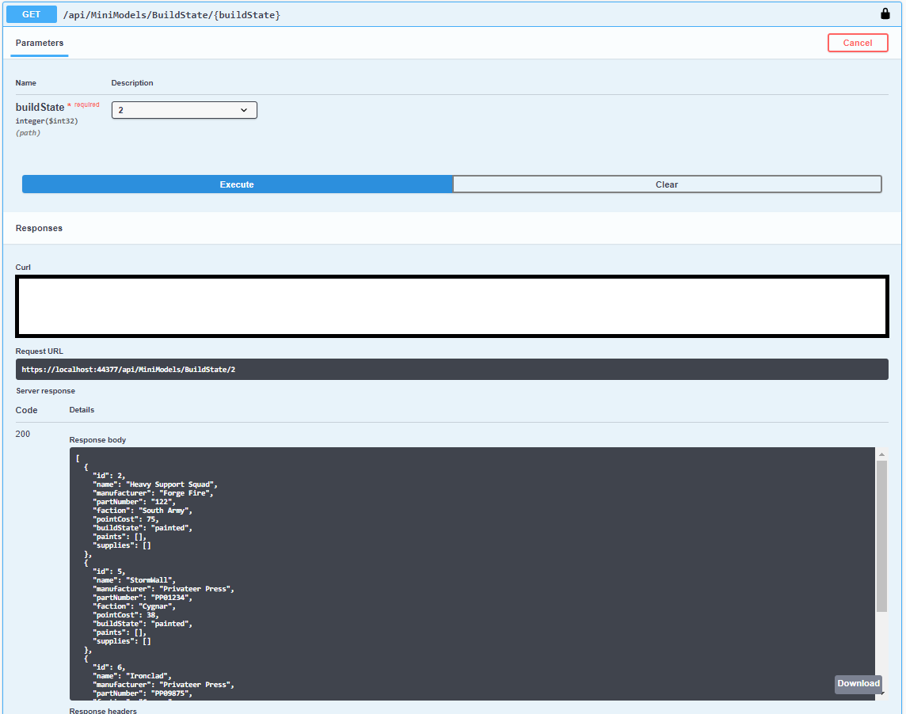
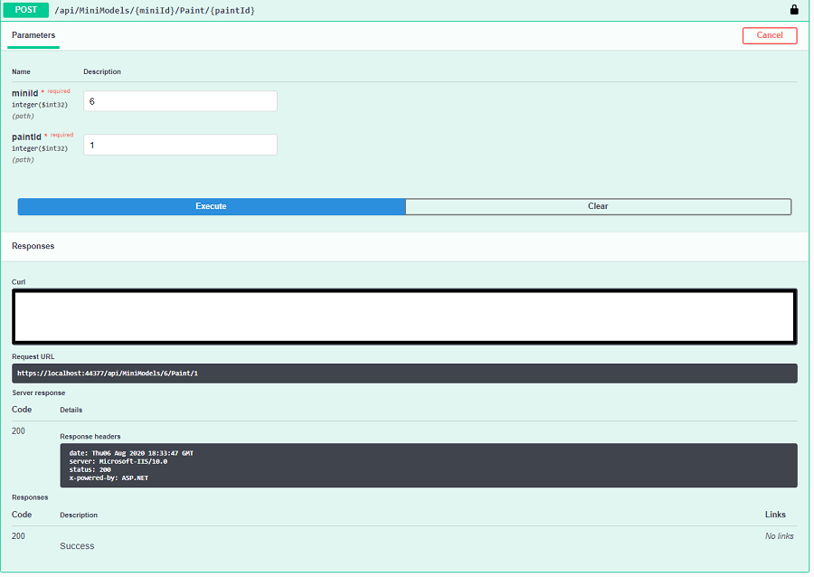
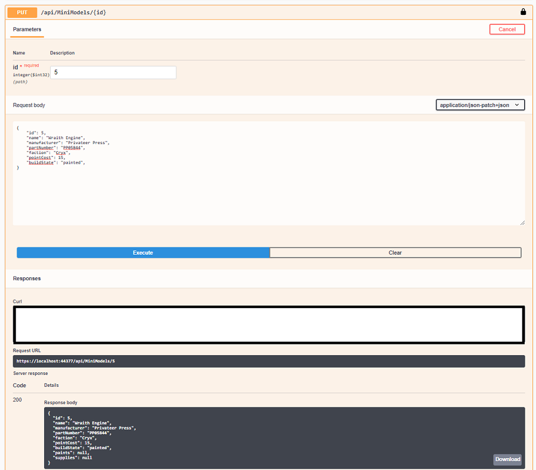
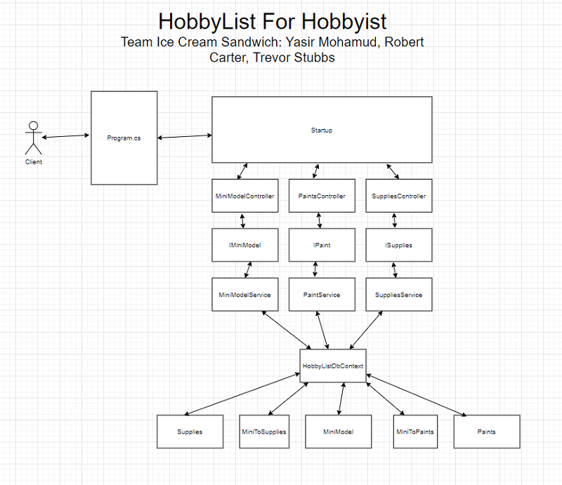
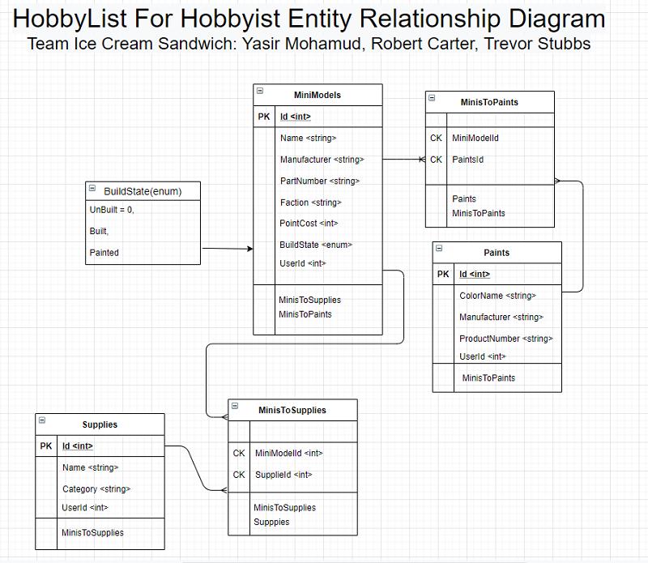

# HobbyList For Hobbyists


- [User Stories and Requirements](Requirements.md)


---
## Web Application
- Hobbyist's Best Friend (Trello for model building)
    - Summary of idea: A web application that allows a user to keep track of all the models and supplies that they own and want.
- What problem or pain point does it solve? 
    - As a modeler it is hard to keep track of the paints and the tools that we currently own and the supplies that we need to buy for the next project. 
      - This app is a table for the tools that the modeler has
      - This app is a table for the paints that the modeler has
      - There is a wishlist table for the tools that the modeler needs.
      - There is a wishlist table for the paints that the modeler needs.
    - As a modeler it is hard to stay organized with all the models that we want to build, the models we are currently building and which models are completely finished.
       - This app is a table for each category. 
       - The user is able to move an item from one table to the next when they are done with that stage to the building process. 
       - This app also has a table for a wishlist for all the models that the user wants to buy.
- Minimum MVP definition.
    - Have a table for each category.
      - Allow the user to Create new paints, tools and models in their respective table.
      - Allow the user to Read all the items in each table
      - Allow the user to Update each item in the table
      - Allow the user to Delete each item in the table
      - Allow the user to Log in so they can see their own data.

---

## Tools Used
Microsoft Visual Studio Community 2017 (Version 15.5.7)

- C#
- Entity Framework
- MVC

---

## Recent Updates

---

## Getting Started TODO

Clone this repository to your local machine.

```
$ git clone https://github.com/YourRepo/HobbyListForHobbyist.git
```
Once downloaded, you can either use the dotnet CLI utilities or Visual Studio 2019 (or greater) to build the web application. 
The solution file is located in the `HobbyListForHobbyist` subdirectory at the root of the repository.
```
cd HobbyListForHobbyist/HobbyListForHobbyist
dotnet build
```
The dotnet tools will automatically restore any NuGet dependencies. Before running the application, the provided code-first migration will need to be applied to the SQL server of your choice configured in the /AmandaFE/AmandaFE/appsettings.json file. This requires the Microsoft.EntityFrameworkCore.Tools NuGet package and can be run from the NuGet Package Manager Console:
```
Update-Database
```
Once the database has been created, the application can be run. Options for running and debugging the application using IIS Express or Kestrel are provided within Visual Studio. From the command line, the following will start an instance of the Kestrel server to host the application:
```
cd HobbyListForHobbyist/HobbyListForHobbyist
dotnet run
```

---

## Usage

### All Available Routes


### View All Miniatures the User Has


### View All Miniatures the User Has that are of selected buildstate


### Adding A paint to a model


### Updating a model


---
## Data Flow


---
## Data Model TODO

### Overall Project Schema


---
## Model Properties and Requirements TODO

### MiniModel

 Parameter | Type 
 --- | --- 
 Id  | int 
 Name | string 
 Manufacturer | string
 PartNumber | string
 Faction | string
 PointCost | int
 BuildState | (enum)
 Email | string

### Paints

Parameter | Type 
--- | --- 
Id  | int 
ColorName | string
Manufacturer | string
ProductNumber | string
Email | string

### Supplies
Parameter | Type
--- | ---
Name | string
Category | string
Email | string

### MiniWishList

 Parameter | Type 
 --- | --- 
 Id  | int 
 Name | string 
 Manufacturer | string
 PartNumber | string
 Faction | string
 PointCost | int
 Price | string
 Email | string


---

## Change Log
- 1.20 Front Page Complete.
- 1.10 Test suite complete and bugs eradicated. 
- 1.00 Functional but slightly buggy MVP
- 0.90 User Id changed to User Email
- 0.80 User Id Added
- 0.70 Supply, Paint and MiniModel controllers finished
- 0.60 Interfaces and Services
- 0.50 DTOs complete
- 0.40 DbContext Complete
- 0.30 Models Complete
- 0.20 Scaffold Models
- 0.10 Repo Build and README started

---

## Authors
- Yasir Mohamud
- Robert Carter
- Trevor Stubbs

---

For more information on Markdown: https://www.markdownguide.org/cheat-sheet