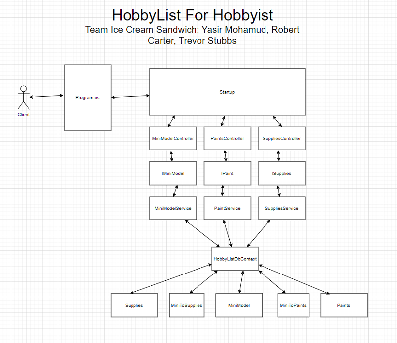
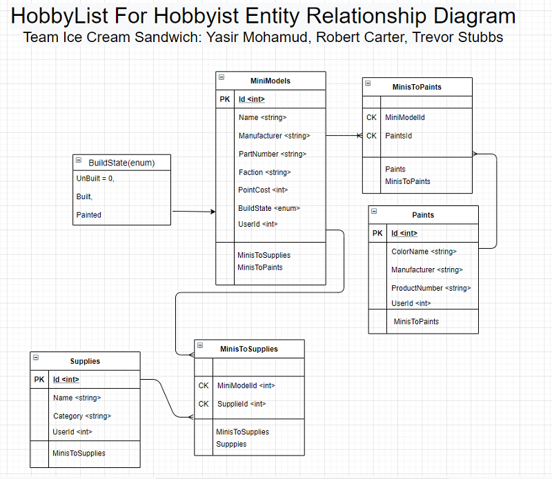

# HobbyList for Hobbyist

## User Stories
1. The Overarching App User Story
    1. As user I want to create database of tools, paints, and miniatures so that I can manage my work flow and completion process of my army build.
    2. Feature Tasks:
        - Have a table that holds all the models that the user owns. 
        - Give the user the ability to see only the models that are either un-built, built, or painted.
        - Have a table that holds all the paints the user owns
        - Allow the user to associate specific paints to their models. 
    3. Acceptance Tests
        - Ensure that the user can create, view, update and delete models from their own database.
        - Ensure the user can create, View, updated and delete paints from their own database.
        - Ensure the user can create, View, updated and delete supplies from their own database.
        - Ensure the user can associate specific paints with specific models

2. The Model Table User Story
    1. As user I want a table to be created that holds information about my miniatures so that I can manage my work flow and completion process of each model.
    2. Feature Tasks:
        - Have a table that holds all the models that the user owns. 
        - Each item in the table will be associated with a specific user.
        - Each element in the table will give details of that specific model.
        - Each model will be in 1 of 3 states. (un-built, built, or painted)
    3. Acceptance Tests
        - Ensure that the user can create, view, update and delete models from their own table.
        - Ensure the user can change the state of the specific model. (un-built, built, or painted).
        - Ensure when the user searches for their models they only see their own models and no one else's.

3. The Paints Table User Story
    1. As user I want a table to be created that holds information about the paints that I own to use on models, so that I can manage my work flow and completion process of each model and to prevent myself from buying duplicate paints.
    2. Feature Tasks:
        - Have a table that holds all the paints that the user owns. 
        - Each item in the table will be associated with a specific user.
        - Each element in the table will give details of that specific the specific paint. - Brand, Color Name, and Product Number
    3. Acceptance Tests
        - Ensure that the user can create, view, update and delete paints from their own table.
        - Ensure when the user searches for their paints they only see their own paints and no one else's.  

4. The Supplies Table User Story
    1. As user I want a table to be created that holds information about the supplies that I use to build miniatures so that I can manage my work flow and completion process of each model and to not buy duplicate supplies.
    2. Feature Tasks:
        - Have a table that holds all the supplies for modeling that the user owns. 
        - Each item in the table will be associated with a specific user.
        - Each element in the table will give details of that specific supply.
    3. Acceptance Tests
        - Ensure that the user can create, view, update and delete supplies from their own table.
        - Ensure when the user searches for their supplies they only see their own supplies and no one else's.

5. Associating Tables User Story
    1. As user I want associate paints and/or supplies to a model so that I can pull out the paints/supplies that I need before I start working so I can speed up the work flow of each project.
    2. Feature Tasks:
        - Have the ability to link paints and/or supplies to a model that is un-built, or unpainted.
        - After the paints/supplies are associated, when the user searches a model a list of those paints/supplies will be displayed.
    3. Acceptance Tests
        - Ensure that the user can view, update and delete the associations from each model.
        - Ensure when the user searches for their models they also see the associations along with all the other details of the model.

---

## Software Requirements
### Vision
1. What is the vision of this product?
    - To help miniature model builder with their workflow
    - To help organize their models, supplies and paints.
    - To help them avoid from buying duplicate models, supplies and paints.
1. What pain point does this project solve?
    - As a modelers it gets really hard to keep track of all the things we have to build and paint.
1. Why should we care about your product?
    - Our software will be help those modelers be better organized.
    - Help modelers to be able to build and paint more models
        - More built models give war-gamers a competitive edge over their opponents.
    - Help remind modelers to finish their projects.

---

### Scope (In/Out)
- IN - What will your product do
    - Have a table that holds all the models that the user owns. 
    - Give the user the ability to see only the models that are either un-built, built, or painted.
    - Have a table that holds all the paints the user owns.
    - Have a table that holds all the supplies the user owns.
    - Allow the user to associate specific paints and/or supplies to their models. 

- Out - What will the product not do
    - This will not complete the models for you.
    - This will not have specific game rules applied to it

---

### MVP
- The user can create, view, update and delete models from their own database.
- The user can create, View, updated and delete paints from their own database.
- The user can create, View, updated and delete supplies from their own database.
- The user can associate specific paints with specific models
- The use can only see their own models, paints, and supplies and no one elses.
### Stretch Goals:
- Make new tables for user's wishlists
    - A table for models
    - A table for paints
    - A table for supplies
- Have specific table for each type of wargame.
- Give the user the ability to share their collection with other users.
- Give the user the ability to build out an army with our app.

---

### Functional Requirements (List the functionality of your product)
1. Have a app admin that can add, update and delete users.
1. Each base user can only see, add, update and delete their own items.
1. Each base user can associate paints and supplies to their own specific models.
1. Each base user can change the state of each model (un-built, built, or painted)

### Data Flow
- After the user logs in
- The use would be given a series of options of how they want to manipulate their data.
- User decided to add a model
    - They are prompted to fill in a form that has the details of the model they want to add.
        - They must select the state the model is in (un-built, built, or painted).
    - After submitting the form a POST would be made to the miniModel controller with a DTO
        - The controller will send the DTO to the service
        - The service will build a new miniModel element to place in the database
        - the database will be saved and a "OK" message will be sent back to the controller-view-user.
- User decides to view their models
    - A GET call will be made to the miniModel controller which would take in the user's ID
        - the controller would send that ID to the service
        - the service would loop through all the items in the table and fill a DTO List with items that match the user's ID.
        - the service would send that DTO List to the controller which would send it to the front end.
- User decides to update a model
    - A PUT call will be made with the miniModel controller which would take the user's ID, the model's ID, and a DTO with the updates.
        - the controller would send the userID, modelID, and DTO to the service.
        - the service would look up the model and the userID and update the db with the new DTO.
        - the service would send back an "OK" message with the updated DTO.
- User decides to delete a model
    - A DELETE call will be made with the miniModel controller which would take the user's ID and the model's ID.
        - the controller would send the userID, and the modelId to the service.
        - the service would look up the modelId and the userId and delete the item from the database.
        - the service would send a "OK" message back to the front-end.

---

### Non-Functional Requirements (requirements that are not directly related to the functionality)
1. Security-
    - Don't allow the user's personal information to be displayed anywhere.
    - Don't ever save the user's password in plain text.
    - Separate the users information from each other.
1. Testability-
    - Be able to test each route independently
    - Be able to test each CRUD method from every service.
    - Have a robust error handling suite that would take care of all edge cases.

---

## Domain Modeling

[Domain Model](https://drive.google.com/file/d/1leShDB2Onh6UROMZ6q3m5lAM2vuj52bt/view?usp=sharing)

---

## Entity Relationship Diagram

[Entity Relationship Diagram](https://drive.google.com/file/d/13Q7wT6SdLCPRVvr6Q51VbC2ykQxv1Q5R/view?usp=sharing)

---

## Resources
[Trello](https://trello.com/b/CwHihggk)